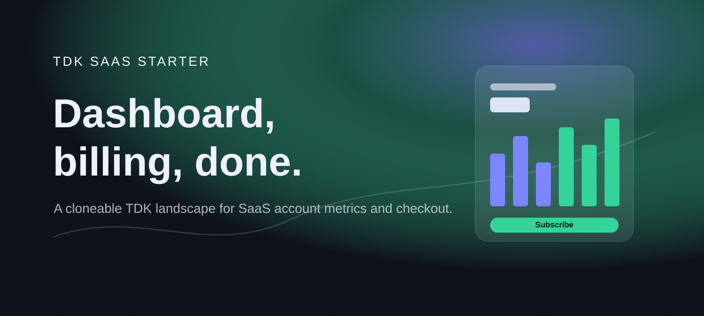
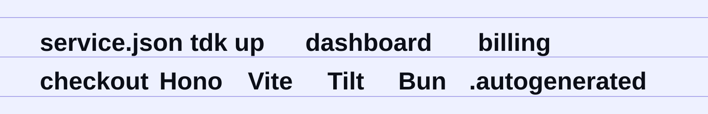
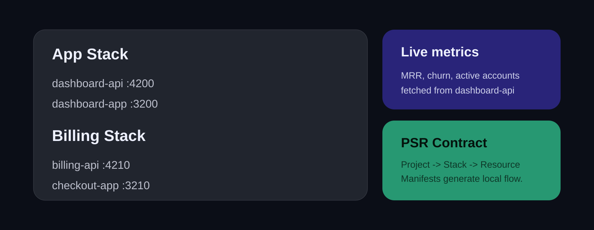
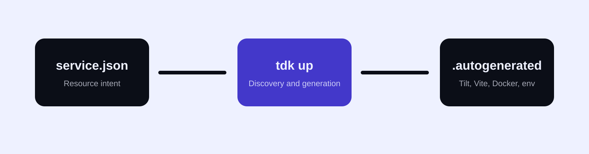

<!-- markdownlint-disable MD013 MD033 MD041 -->

<p align="center">
  
</p>

<p align="center">
  <a href="#run-it">Run it</a>
  &nbsp;&nbsp;/&nbsp;&nbsp;
  <a href="#the-landscape">Explore the landscape</a>
  &nbsp;&nbsp;/&nbsp;&nbsp;
  <a href="#generation">Understand generation</a>
  &nbsp;&nbsp;/&nbsp;&nbsp;
  <a href="#demo-walkthrough">Demo Walkthrough</a>
  &nbsp;&nbsp;/&nbsp;&nbsp;
  <a href="https://github.com/tdk-landscape/tdk-cli">TDK CLI</a>
</p>

<br>

## A SaaS Dashboard and Checkout, One Clone Away

This repository is a polished TDK **Project-Stack-Resource (PSR)** starter for SaaS products: account metrics, activity, pricing plans, and a working checkout button split into independently runnable resources.

You declare each SaaS service in a compact `service.json`. TDK discovers the landscape, resolves resource dependencies, allocates ports, and generates local Docker, Vite, environment, and TypeScript plumbing inside `.autogenerated/`.

<p align="center">
  
</p>

## Run It

### Prerequisites

- [Docker](https://docs.docker.com/get-docker/) is running.
- [Tilt](https://docs.tilt.dev/install.html) is installed.
- [Bun 1.2+](https://bun.sh/docs/installation) is installed.
- [TDK CLI](https://github.com/tdk-landscape/tdk-cli#installation) is available as `tdk`.

```bash
git clone https://github.com/tdk-landscape/tdk-saas-starter.git
cd tdk-saas-starter
tdk up
```

TDK starts both stacks from their resource manifests.

```bash
# Start one SaaS domain stack
tdk up app
tdk up billing

# Inspect the running landscape
tdk status

# Stop the landscape
tdk down
```

## The Landscape

<p align="center">
  
</p>

| Stack | Resource | Type | Runtime | Port | Dependencies | Primary Capability |
| --- | --- | --- | --- | ---: | --- | --- |
| **app** | [`dashboard-api`](services/app/dashboard-api) | Backend API | Hono 4 / Bun | [`4200`](http://localhost:4200/health) | None | MRR, growth, churn, and account activity |
| **app** | [`dashboard-app`](services/app/dashboard-app) | Frontend App | Vite 5 / React | [`3200`](http://localhost:3200) | `dashboard-api` | Live account dashboard |
| **billing** | [`billing-api`](services/billing/billing-api) | Backend API | Hono 4 / Bun | [`4210`](http://localhost:4210/health) | None | Plans, subscriptions, and checkout sessions |
| **billing** | [`checkout-app`](services/billing/checkout-app) | Frontend App | Vite 5 / React | [`3210`](http://localhost:3210) | `billing-api` | Pricing page with a working Subscribe button |

```text
tdk-saas-starter/
├── DEMO_GUIDE.md
├── docs/
│   ├── readme-hero.svg
│   ├── readme-marquee.svg
│   ├── readme-bento.svg
│   └── readme-flow.svg
└── services/
    ├── app/
    │   ├── dashboard-api/
    │   └── dashboard-app/
    └── billing/
        ├── billing-api/
        └── checkout-app/
```

## Generation

<p align="center">
  
</p>

Every SaaS resource owns a compact declarative manifest:

```json
{
  "appName": "billing-api",
  "stack":"billing",
  "appType": "backend",
  "port": 4210,
  "dependsOn": [],
  "healthCheck": {
    "enabled": true,
    "path": "/health"
  }
}
```

Running `tdk up` turns those manifests into local orchestration files for Tilt, Docker, Vite, and Bun.

> [!IMPORTANT]
> Edit `service.json` or the TDK generation config. Never edit `.autogenerated/` directly; TDK regenerates its contents.

## Project, Stack, Resource

| Level | Meaning in TDK SaaS Starter | Command Surface |
| --- | --- | --- |
| **Project** | The entire SaaS starter landscape | `tdk up`, `tdk down`, `tdk status` |
| **Stack** | A product area: `app` or `billing` | `tdk up billing` |
| **Resource** | One API or web console | `tdk resource <name> ...` |

## The Payment Button

`checkout-app` renders live plans from `billing-api` and wires a real `Subscribe` button to `POST /api/v1/checkout-session`. The response is a mock session id, plan, amount, and checkout URL — enough to demo a checkout flow, or swap in a real payment provider later without touching the rest of the landscape.

## Demo Walkthrough

Open [DEMO_GUIDE.md](DEMO_GUIDE.md) for a three-minute walkthrough that shows how an account dashboard and a checkout flow can be split into TDK resources without hand-wiring local orchestration.

## Testing Individual Resources

Each resource is standalone and testable:

```bash
cd services/billing/billing-api
bun install
bun run typecheck
```

---

<p align="center">
  <strong>Declare the SaaS. Generate the landscape. Ship the checkout.</strong>
</p>

<p align="center">
  <a href="https://github.com/tdk-landscape">TDK Landscape</a>
  &nbsp;&nbsp;/&nbsp;&nbsp;
  <a href="https://github.com/tdk-landscape/tdk-cli">CLI</a>
  &nbsp;&nbsp;/&nbsp;&nbsp;
  <a href="DEMO_GUIDE.md">Demo Guide</a>
  &nbsp;&nbsp;/&nbsp;&nbsp;
  MIT License
</p>
